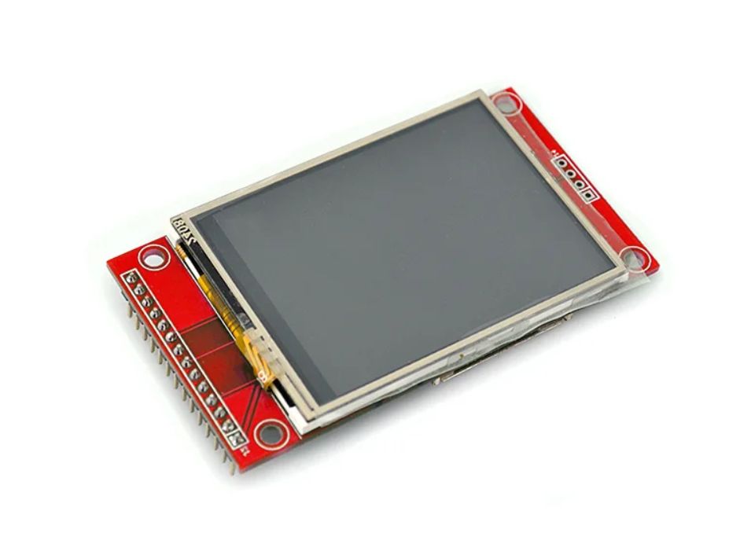
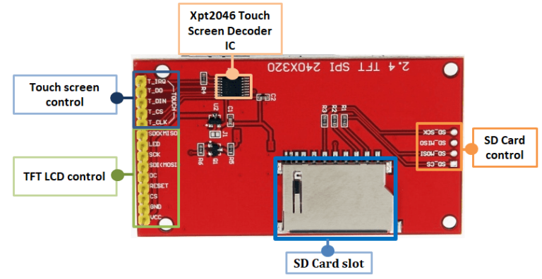
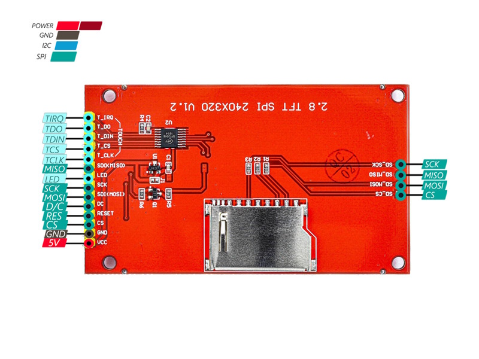
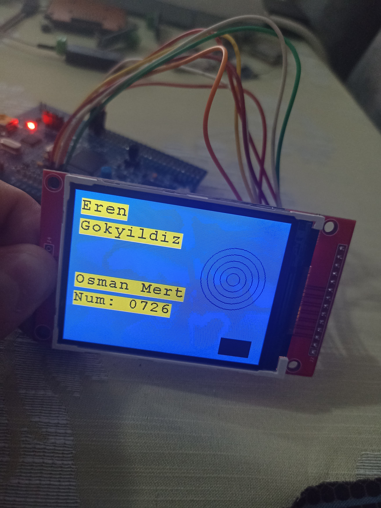

# STM32 ILI9341 TFT LCD Display

📱 A comprehensive and customizable C library for controlling an ILI9341-based TFT LCD display over SPI with STM32F407VG microcontroller.

---

## Introduction Project

I used the product that appears below in my own project. The model I used didn't have the integration (XPT2046) required for the Touch feature, but it wouldn't be a problem if it was on yours.
<div style="text-align: center;">
  
</div>

The picture below are the peripherals and pins on the display module. I did not do the touch part (XPT2046) because there is no necessary entagre in the product I have. This library deals with the TFT LCD Control part.
<div style="text-align: center;">
  
</div>
The pin outputs are as they appear below
<div style="text-align: center;">
  
</div>
This is my lcd picture
<div style="text-align: center;">
  
</div>

---

## 📁 Project Structure

```
ILI9341/
    ├── Inc/
        ├── fonts.h             # Header file for fonts
        └── ILI9341.h           # Header file for driver
    └── Src/
        ├── font8.c             # 8-pixel font library
        ├── font12.c            # 12-pixel font library
        ├── font16.c            # 16-pixel font library
        ├── font20.c            # 20-pixel font library
        ├── font24.c            # 24-pixel font library
        └── ILI9341.c           # Source file for driver
```

## 📡 Features

- High-speed SPI communication
- GPIO control for CS, DC, RST pins
- 16-bit color (RGB565) support
- Basic graphics drawing:
  - Pixel, line, rectangle, circle drawing
  - Area filling (`FillRect`, `FillScreen`)
- Text rendering:
  - Font selection
  - Foreground and background color control
  - `printf` support
- Rotation support (0° / 90° / 180° / 270°)
- Lightweight and extendable structure
---

## Hardware Requirements

- STM32F407VG (or similar) microcontroller
- ILI9341-based TFT LCD screen
- SPI interface connection:
  - `MOSI`, `SCK`, `CS`, `DC`, `RST` pins
- STM32 HAL libraries must be enabled
---

## Configuration

Define an `ILI9341_HandleTypeDef` structure and call `ILI9341_init()` to initialize:

```c
ILI9341_HandleTypeDef tft = {
    .RST = {RST_GPIO_Port, RST_Pin},
    .CS  = {CS_GPIO_Port, CS_Pin},
    .DC  = {DC_GPIO_Port, DC_Pin},
    .hspi = &hspi1,
};

ILI9341_init(&tft);
```

## Basic Usage Examples

### Fill Screen

```c
ILI9341_FillScreen(&tft, ILI9341_BLACK);
```

### Print Text

```c
ILI9341_SetFont(&tft, &Font16);
ILI9341_SetTextColor(&tft, ILI9341_GREEN);
ILI9341_SetBackColor(&tft, ILI9341_BLACK);
ILI9341_String(&tft, 10, 10, "Hello World");
```

### Draw Graphics

```c
ILI9341_DrawLine(&tft, ILI9341_RED, 0, 0, 100, 100);
ILI9341_DrawRect(&tft, ILI9341_BLUE, 10, 10, 50, 50);
ILI9341_DrawCircle(&tft, 120, 160, 30, ILI9341_YELLOW);
```

### Printf Support

```c
ILI9341_Printf(&tft, 10, 50, "Temp: %d C", temperature);
```

### Set Rotation

```c
ILI9341_SetRotation(&tft, 1);  // 0: 0°, 1: 90°, 2: 180°, 3: 270°
```

## Available Colors

```c
ILI9341_BLACK
ILI9341_BLUE
ILI9341_RED
ILI9341_GREEN
ILI9341_CYAN
ILI9341_MAGENTA
ILI9341_YELLOW
ILI9341_WHITE
```

## Fonts

The library supports 5 different font sizes: `Font8`, `Font12`, `Font16`, `Font20`, `Font24`. Default font is `Font16`.

```c
ILI9341_SetFont(&tft, &Font12);
```

## License

This project is licensed under the MIT License. See the `LICENSE` file for more information.

## Author

👨‍💻 Semi Eren Gökyıldız  
🔗 [LinkedIn](https://www.linkedin.com/in/semi-eren-gokyildiz/)

---

> This library allows direct and efficient control of ILI9341 displays in STM32-based projects. Open to contributions and improvements!
